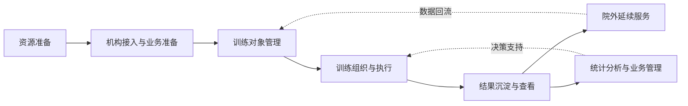

# 综合产品总体需求说明书
**项目名称：ADHD 综合训练管理系统**

## 1. 文档目的

本文档用于从综合产品视角，定义 ADHD 综合训练管理系统的整体定位、建设目标、适用范围、产品边界、业务闭环及系统组成，为后续系统域需求、软件需求及专题需求提供统一依据。

本文档仅描述**产品需求层内容**，不涉及界面设计、技术架构、代码实现、算法逻辑、测试方案、部署运维等内容。

---

## 2. 项目背景

ADHD 综合训练管理系统面向 ADHD 相关训练与管理场景，目标是在医疗机构、院内业务执行场景及院外持续服务场景之间，建立一套完整、可协同、可管理、可追踪的综合产品体系。

随着 ADHD 训练服务逐步从单点执行走向系统化管理，现有工作方式通常存在以下问题：

1. **业务链条分散**  
   训练资源管理、院内执行、院外延续服务、数据汇总与管理往往分别存在，缺少统一的产品协同体系。

2. **系统职责边界不清**  
   平台侧、院内侧、院外侧各自承接的职责缺乏统一定义，导致功能重复、数据口径不一致、流程割裂。

3. **多软件组合关系不清晰**  
   院内、院外场景通常并非由单一软件承接，而是由管理后台、执行终端、服务终端等多个软件共同完成，但现有文档难以体现软件之间的明确分工。

4. **业务过程难以闭环**  
   从训练资源准备、训练方案下发、执行过程管理、结果汇总分析，到后续持续跟踪，缺少统一视角下的业务闭环定义。

5. **需求文档长期演进后结构失衡**  
   需求信息散落在不同目录和材料中，按历史形成方式堆积，导致后续查找困难、维护成本高、整体一致性不足。

因此，需要从综合产品视角重新梳理 ADHD 综合训练管理系统的总体需求，明确系统域、软件、协同关系和业务边界，形成统一、可扩展、可维护的产品需求体系。

---

## 3. 建设目标

ADHD 综合训练管理系统的建设目标，不是构建单一软件，而是构建一个由多个系统域与多个软件共同组成的综合产品体系。

整体目标如下：

### 3.1 建立统一的综合产品体系
从产品层面对平台域、院内业务域、院外服务域进行统一规划，形成清晰的整体结构，避免各部分独立建设、口径分散。

### 3.2 建立完整的业务闭环
围绕 ADHD 训练服务全过程，形成从资源准备、组织管理、训练执行、过程记录、结果呈现到持续跟进的完整业务链条。

### 3.3 明确系统域与软件职责
明确医院资源与数据网关平台、院内封闭业务域、院外公网服务域分别承担的职责，并进一步明确各域内不同软件的定位与分工。

### 3.4 提升管理效率与协同效率
通过统一的产品体系设计，使机构管理、训练组织、执行跟踪、结果查看、统计分析等工作具备更清晰的职责归属与协同关系。

### 3.5 支撑持续演进与分期建设
建立适合长期演进的需求结构，为后续功能扩展、软件新增、业务优化和分期推进提供稳定基础。

---

## 4. 产品定位

ADHD 综合训练管理系统是一个面向 ADHD 训练服务场景的**综合产品体系**。  
它不是单一系统，也不是单一软件，而是由多个系统域共同组成，并在每个系统域内部由多个软件协同承接具体业务。

该综合产品体系主要覆盖以下三个层面：

1. **平台层面**  
   负责面向机构、资源、数据等进行统一管理和支撑。

2. **院内层面**  
   负责承接医院内部训练管理、训练组织、执行管理和结果查看等核心业务。

3. **院外层面**  
   负责承接院外持续服务、用户触达、服务延伸和外部使用场景支持。

因此，ADHD 综合训练管理系统的产品定位是：

> 以 ADHD 训练服务全过程为核心，通过平台域、院内业务域、院外服务域协同运作，支撑训练资源管理、业务执行管理、持续服务管理与结果沉淀管理的一体化综合产品体系。

---

## 5. 适用范围

本产品需求适用于 ADHD 综合训练管理系统相关的产品规划、需求拆解、系统域设计、软件职责划分和业务范围界定。

### 5.1 适用业务范围
本系统主要适用于与 ADHD 训练服务相关的以下业务范围：

- 训练资源的统一管理与分发
- 医疗机构内部训练业务管理
- 训练对象的组织与管理
- 训练执行过程的记录与跟踪
- 训练结果与评估结果的查看与管理
- 院外延续服务与使用场景支持
- 综合性数据查询、业务统计与管理支持

### 5.2 适用组织范围
本系统适用于围绕 ADHD 训练服务开展工作的相关机构和组织，包括但不限于：

- 提供 ADHD 训练服务的医疗机构
- 平台运营与管理主体
- 与训练过程相关的业务管理部门
- 承担训练执行与跟踪职责的相关人员

### 5.3 适用产品范围
本系统适用于综合产品体系中的以下部分：

- 医院资源与数据网关平台
- 院内封闭业务域
- 院外公网服务域
- 各系统域内部的软件产品
- 各系统域之间的协同流程与业务规则

---

## 6. 参与角色概览

从综合产品视角看，本系统涉及的角色不应只按“账号类型”理解，而应按“参与关系”和“业务职责”理解。总体上可分为平台管理、医院管理、业务执行、训练对象及院外服务等几类角色。

为便于对整体使用对象形成具象认知，现给出角色清单示例如下：

| 角色域 | 示例角色 | 主要职责场景 |
|-------|---------|------------|
| 平台管理 | 平台运营人员、超级管理员 | 机构接入审核、平台规则维护、资源上架、平台级数据查看 |
| 医院管理 | 科室主任、训练师主管、院内管理员 | 训练排班、人员分配、院内组织管理、业务监督 |
| 业务执行 | 训练师、康复师、评估人员 | 训练执行、过程记录、结果录入、阶段跟进 |
| 训练对象 | 儿童患者、家长/监护人 | 参与训练、配合执行、查看阶段结果、接受院外服务 |
| 外部服务 | 随访专员、客服、运营支持人员 | 院外提醒、随访触达、服务跟进、问题反馈 |

> 注：以上角色仅用于总体需求层的角色认知示例，不作为最终权限模型定义。具体角色边界、权限范围及软件归属关系，将在后续角色体系、系统域需求和软件需求文档中进一步明确。

---

## 7. 综合产品组成

ADHD 综合训练管理系统由三个核心系统域组成：

### 7.1 医院资源与数据网关平台
该系统域承担综合产品体系中的平台支撑职责，主要负责机构层面的统一管理、资源的统一组织与分发、平台级数据查询与业务支撑等工作。

它在整体产品体系中承担“统一支撑与统一连接”的角色。

### 7.2 院内封闭业务域
该系统域承担医院内部训练相关业务的组织与执行职责。  
其内部并非单一软件，而是由多个软件共同组成，例如院内管理后台、安卓平板软件等。

它在整体产品体系中承担“院内核心业务执行与管理”的角色。

### 7.3 院外公网服务域
该系统域承担院外场景下的服务延续与业务触达职责。  
其内部同样不是单一软件，而可能由多个院外服务软件共同组成。

它在整体产品体系中承担“院外服务承接与持续连接”的角色。

### 7.4 综合产品逻辑架构图

```text
┌──────────────────────────────────────────────────────┐
│                医院资源与数据网关平台                 │
│     （机构管理 / 资源分发 / 数据网关 / 平台支撑）      │
└──────────────────────┬───────────────────────────────┘
                       │
        ┌──────────────┴──────────────┐
        ▼                             ▼
┌──────────────────────┐    ┌──────────────────────┐
│     院内封闭业务域     │    │    院外公网服务域      │
│                      │    │                      │
│ • 院内管理后台        │    │ • 院外用户服务端      │
│ • 安卓平板软件        │    │ • 院外业务管理端      │
│ • 其他院内执行软件    │    │ • 其他院外服务软件    │
└──────────────────────┘    └──────────────────────┘
```

该图用于说明本综合产品体系的基本层次关系：
- 平台域位于上层，承担统一支撑与统一连接职责；
- 院内域与院外域位于业务承接层，分别面向院内和院外场景；
- 每个系统域内部可由多个软件共同组成，而非仅对应一个独立软件。

---

## 8. 整体业务闭环概述

从综合产品视角，ADHD 综合训练管理系统需要支撑一条完整的业务闭环。  
该业务闭环不等于某一个软件中的流程，而是跨系统域、跨软件共同完成的整体过程。

### 8.1 业务闭环图



### 8.2 阶段说明

#### 8.2.1 资源准备阶段
围绕训练服务所需的课程、训练内容、业务规则、管理配置等进行统一组织和准备。

#### 8.2.2 机构接入与业务准备阶段
完成机构侧的接入、组织准备、角色配置、业务启用等基础工作，为实际训练业务开展提供前提。

#### 8.2.3 训练对象管理阶段
围绕训练对象的组织、管理、维护和使用，为后续训练安排与执行提供基础支撑。

#### 8.2.4 训练组织与执行阶段
在院内或相关使用场景中完成训练任务安排、训练执行、过程记录与状态跟踪。

#### 8.2.5 结果沉淀与查看阶段
将训练过程结果、阶段性结果、综合性结果进行汇总、呈现与管理，用于业务查看和后续判断。

#### 8.2.6 院外延续服务阶段
在院外服务域中承接持续服务、结果触达、延续使用或相关服务支持场景。

#### 8.2.7 统计分析与业务管理阶段
基于整体业务运行情况，为平台侧、机构侧和相关管理角色提供统计分析、业务管理和决策支持能力。

---

## 9. 核心术语说明

为保证后续系统域需求、软件需求及专题需求在表述上的一致性，本文档先定义一批核心术语：

| 术语 | 定义 |
|-----|------|
| ADHD 综合训练管理系统 | 面向 ADHD 训练与管理场景、由多个系统域和多个软件共同组成的综合产品体系 |
| 系统域 | 在综合产品体系中承担一类相对完整职责边界的业务域，如平台域、院内域、院外域 |
| 软件 | 隶属于某一系统域、承接具体业务场景和功能需求的独立软件载体 |
| 训练对象 | 接受 ADHD 训练服务的核心服务对象，通常为儿童患者及其相关服务参与对象 |
| 训练资源 | 可被统一组织、分发和使用的课程、训练内容、量表、模板等可复用业务资产 |
| 训练内容 | 面向训练执行环节的具体训练项目、训练材料或训练活动内容 |
| 训练方案 | 面向特定训练对象制定的一组训练任务安排、执行节奏和管理要求 |
| 院内封闭业务域 | 主要承接医院内部训练管理与执行场景、运行于院内封闭环境下的业务系统集合 |
| 院外公网服务域 | 主要承接院外持续服务、用户触达和外部服务场景的业务系统集合 |
| 医院资源与数据网关平台 | 面向机构管理、资源分发、数据支撑和统一连接职责的平台级系统域 |

> 注：本节仅给出总体需求层的统一定义，后续术语如需扩展、细化或形成正式术语标准，将在《术语与统一定义》文档中进一步整理。

---

## 10. 产品范围与边界

### 10.1 产品范围

本综合产品体系重点关注以下范围：

- 围绕 ADHD 训练服务全过程的产品支撑
- 多系统域协同下的业务组织与管理
- 多软件协同承接业务的需求定义
- 训练资源、训练执行、结果查看、业务管理相关的产品需求
- 院内与院外场景衔接下的持续服务需求

### 10.2 产品边界

本文档不涉及以下内容：

- 界面设计方案
- 技术架构设计
- 数据库设计
- 接口协议设计
- 算法实现逻辑
- 测试用例与测试方案
- 部署方案
- 运维方案
- 监控、告警、基础设施配置等技术性内容

### 10.3 需求边界原则

在后续需求拆解中，需遵循以下原则：

1. **先总后分**：先定义综合产品，再定义系统域，再定义软件。  
2. **先职责后功能**：先明确定位与边界，再展开功能需求。  
3. **跨域内容单独表达**：系统域之间的协同需求应独立表达，不混入单个软件文档。  
4. **专题能力统一收口**：横跨多个域和软件的共性能力，应通过专题需求统一描述。  

---

## 11. 本期交付物

本期围绕需求重构与总体梳理，重点交付以下文档：

| 序号 | 交付物 | 说明 |
|------|--------|------|
| 1 | 综合产品总体需求说明书 | 定义综合产品的整体定位、边界、闭环和组成 |
| 2 | 医院资源与数据网关平台-域需求说明 v1.0 | 明确平台域的职责、范围和业务定位 |
| 3 | 院内封闭业务域-域需求说明 v1.0 | 明确院内域的职责、组成和业务闭环 |
| 4 | 院外公网服务域-域需求说明 v1.0 | 明确院外域的职责、组成和服务场景 |
| 5 | 系统域职责分工与边界说明 v1.0 | 明确三大系统域之间的职责分工和边界关系 |
| 6 | 跨域业务协同需求 v1.0 | 说明跨域业务如何衔接、流转和协同 |
| 7 | 跨域数据流转需求 v1.0 | 从产品角度定义跨域数据的归属、流转和使用关系 |

---

## 12. 非本期交付物

以下内容不作为本期需求重构阶段的重点交付物，将在后续迭代中逐步展开：

| 类别 | 非本期交付物 |
|------|-------------|
| 软件级 PRD | 院内管理后台 PRD、安卓平板软件 PRD、院外用户服务端 PRD、院外业务管理端 PRD |
| 专题需求 | 用户与权限管理专题、训练对象管理专题、课程与训练资源管理专题、训练执行专题、报告与评估专题 |
| 设计与实现 | 界面原型、交互设计、技术方案、接口方案、算法说明 |
| 交付与运行 | 测试方案、部署方案、上线方案、运维手册 |

---

## 13. 后续文档拆解原则

基于本文档，后续需求文档应按以下顺序拆解：

1. 先形成系统域层文档  
   - 医院资源与数据网关平台-域需求说明  
   - 院内封闭业务域-域需求说明  
   - 院外公网服务域-域需求说明  

2. 再形成跨域协同文档  
   - 系统域职责分工与边界说明  
   - 跨域业务协同需求  
   - 跨域数据流转需求  

3. 再形成软件级 PRD  
   - 院内管理后台  
   - 安卓平板软件  
   - 院外用户服务端  
   - 院外业务管理端  
   - 平台相关软件  

4. 最后形成专题需求文档  
   - 用户与权限  
   - 训练对象  
   - 课程资源  
   - 训练执行  
   - 报告评估  
   - 数据查询与统计等  
