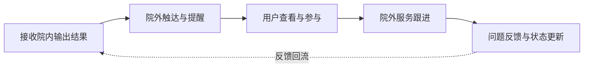

# 院外公网服务域-域需求说明
**项目名称：ADHD 综合训练管理系统**

## 1. 文档目的

本文档用于从系统域视角，定义 ADHD 综合训练管理系统中“院外公网服务域”的定位、建设目标、业务范围、内部组成、核心业务闭环及域内软件协同关系，为后续院外用户服务端、院外业务管理端等软件级产品需求文档提供上位依据。

本文档重点回答以下问题：

- 院外公网服务域在整个综合产品体系中的作用是什么
- 院外公网服务域要解决哪些院外场景问题
- 院外公网服务域包含哪些软件组成
- 各软件在本域中如何分工协同
- 院外公网服务域与平台域、院内域如何衔接

本文档仅描述**产品需求层内容**，不涉及界面设计、技术架构、接口协议、代码实现、算法、测试、部署及运维内容。

---

## 2. 系统域定位

院外公网服务域是 ADHD 综合训练管理系统中的**院外服务承接域**，主要承接医院外部网络环境下与 ADHD 训练服务相关的持续服务、用户触达、结果延续使用、随访跟进及外部服务支持等业务。

该系统域服务于院外场景，不承担院内训练执行主场职责，也不承担平台级统一组织与管理职责，而是聚焦于“训练服务从院内延伸到院外”的业务承接。

从综合产品体系角度看，院外公网服务域承担以下角色：

- 是院内训练服务向院外延续的主要承接场
- 是训练对象及家长/监护人在院外持续接收服务的主要触达场
- 是结果延续查看、提醒、随访、持续支持等场景的主要发生场
- 是连接院内业务沉淀与院外持续陪伴之间的重要业务域

---

## 3. 建设目标

院外公网服务域的建设目标如下：

### 3.1 支撑院外持续服务闭环
形成覆盖院外触达、结果延续查看、持续跟进和外部服务支持的院外服务闭环。

### 3.2 支撑训练服务从院内延伸到院外
使训练服务不只停留在院内执行环节，而能够在院外场景中继续承接、延续和补充。

### 3.3 支撑多角色参与院外服务
支撑训练对象、家长/监护人、随访人员、客服及其他院外服务角色参与相关服务流程。

### 3.4 支撑多软件协同承接院外场景
通过院外用户服务端、院外业务管理端等软件共同承接院外服务场景，形成清晰的软件分工关系。

### 3.5 支撑与院内域、平台域的稳定衔接
向上承接平台域提供的统一支撑，向内承接院内域输出的结果与业务基础，形成完整服务链条。

---

## 4. 服务对象

院外公网服务域主要服务于院外场景中的使用角色和服务角色。  
主要服务对象包括：

| 角色类型 | 示例角色 | 主要使用诉求 |
|---------|---------|-------------|
| 训练对象相关角色 | 儿童患者、家长/监护人 | 查看结果、接收提醒、参与院外服务、延续训练支持 |
| 院外服务角色 | 随访专员、客服、服务支持人员 | 发起随访、服务跟进、问题处理、院外提醒 |
| 院外管理角色 | 业务管理人员、运营支持人员 | 查看院外服务进展、管理服务过程、跟踪服务状态 |
| 关联业务角色 | 与院内衔接的业务辅助人员 | 关注院外反馈、承接跨域衔接事项 |

注：本域面向院外服务承接，不以院内训练执行角色为主要使用对象。

---

## 5. 业务范围

院外公网服务域的业务范围应聚焦于院外场景下的持续服务与用户触达。

### 5.1 纳入本域的业务范围

1. **院外结果延续查看**  
   包括训练对象及相关参与者在院外场景下对训练结果、阶段结果或相关信息的查看。

2. **院外提醒与服务触达**  
   包括与训练相关的通知提醒、随访提醒、服务触达等院外触达型场景。

3. **院外持续跟进与服务支持**  
   包括围绕训练对象开展的院外持续服务、随访、问题反馈与支持工作。

4. **院外业务管理与进度跟踪**  
   包括对院外服务进展、服务状态和相关管理事项的跟踪与管理。

5. **院外与院内衔接支持**  
   包括承接院内业务输出内容并在院外继续完成相关延续服务。

### 5.2 不纳入本域的业务范围

1. 院内训练执行本身  
2. 平台级机构统一管理  
3. 平台级资源统一组织与分发  
4. 院内训练对象的主管理过程  
5. 平台级跨机构数据治理职责  

---

## 6. 业务边界

院外公网服务域的业务边界可概括为：

> **聚焦院外场景下的服务承接、用户触达和结果延续，不替代院内业务执行，也不替代平台统一支撑。**

### 6.1 向上边界
向上依赖医院资源与数据网关平台提供统一连接、规则支撑及必要的平台能力。

### 6.2 向内边界
向内承接院内封闭业务域输出的训练结果、业务状态和延续服务基础，但不回头替代院内训练执行流程。

### 6.3 域内边界
本域内部由多个软件共同组成，不同软件分别承接用户服务、业务管理、服务支撑等不同场景。

---

## 7. 域内软件组成

院外公网服务域不是单一软件，而是多个院外服务软件共同组成的业务域。当前建议至少包括以下两个核心软件：

| 软件 | 软件定位 | 主要承接场景 |
|------|---------|-------------|
| 院外用户服务端 | 面向训练对象及家长/监护人的院外服务入口 | 结果查看、提醒接收、院外参与、服务触达 |
| 院外业务管理端 | 面向院外服务角色和管理角色的管理入口 | 随访管理、服务进度跟踪、院外业务管理 |

除上述软件外，如后续存在新的院外服务软件、外部触达载体或辅助管理端，也应纳入本域统一规划。

---

## 8. 域内软件分工原则

为避免院外域内不同软件职责混乱，需遵循以下分工原则：

### 8.1 用户服务端负责“接收与参与”
院外用户服务端主要承接训练对象及家长/监护人的院外使用场景，包括接收提醒、查看结果、参与服务等。

### 8.2 业务管理端负责“组织与跟进”
院外业务管理端主要承接院外服务角色对随访、服务跟进、进度管理和问题处理等管理型职责。

### 8.3 服务触达与服务管理分离
不应将用户服务端写成完整管理系统，也不应将业务管理端写成面向训练对象的主要服务入口。两者应保持角色分工清晰。

### 8.4 软件协同完成院外闭环
院外服务闭环由多个软件协同完成，而不是由单一软件承接全部院外场景。

---

## 9. 院外业务闭环概述

从院外公网服务域视角，业务闭环主要围绕结果延续查看、提醒触达、服务跟进和反馈回流展开。

### 9.1 院外业务闭环图

### 9.2 阶段说明

#### 9.2.1 接收院内输出结果
承接由院内业务域输出的训练结果、阶段信息或后续服务所需的基础内容。

#### 9.2.2 院外触达与提醒
通过院外服务能力向训练对象及相关参与者提供提醒、通知或服务触达。

#### 9.2.3 用户查看与参与
训练对象及家长/监护人在院外场景下查看相关结果并参与必要的服务流程。

#### 9.2.4 院外服务跟进
院外服务角色围绕对象开展随访、服务支持和问题处理等工作。

#### 9.2.5 问题反馈与状态更新
院外服务过程中产生的问题、反馈和状态变化应形成更新，并在需要时与其他业务环节衔接。

---

## 10. 核心需求清单

从系统域层看，院外公网服务域至少应具备以下核心需求能力：

| 需求编号 | 需求名称 | 需求说明 |
|---------|---------|---------|
| OUT-01 | 院外结果延续查看 | 支撑训练对象及相关参与者在院外场景下查看相关结果信息 |
| OUT-02 | 院外提醒与触达 | 支撑与训练相关的提醒、通知和院外触达场景 |
| OUT-03 | 院外服务参与 | 支撑训练对象及家长/监护人在院外继续参与相关服务流程 |
| OUT-04 | 院外服务跟进 | 支撑随访、服务支持、问题处理等院外服务过程 |
| OUT-05 | 院外进度与状态管理 | 支撑对院外服务进展和状态的查看与管理 |
| OUT-06 | 域内软件协同 | 支撑用户服务端与业务管理端之间形成稳定协同闭环 |
| OUT-07 | 与院内域衔接 | 支撑承接院内输出并开展院外延续服务 |
| OUT-08 | 与平台域衔接 | 支撑本域承接平台提供的统一支撑基础 |

---

## 11. 域内软件协同关系

院外公网服务域的关键不只是“给谁用”，还在于不同软件如何协同完成服务闭环。

### 11.1 用户服务端与业务管理端的关系
两者关系可以概括为：

- 用户服务端偏面向对象触达与参与
- 业务管理端偏面向服务角色的组织与跟进
- 用户服务端形成用户侧感知入口
- 业务管理端形成服务侧管理入口

### 11.2 基本协同逻辑
基本协同逻辑如下：

1. 院外业务管理端组织服务跟进或触达任务  
2. 用户服务端承接训练对象及家长/监护人的查看与参与行为  
3. 用户侧参与和反馈回到服务管理视角  
4. 服务管理端持续跟进并在必要时与其他系统域衔接  

### 11.3 协同原则
域内软件协同需遵循以下原则：

- 同一服务动作应有清晰主承接软件  
- 用户体验入口与服务管理入口尽量分离  
- 用户侧结果和反馈应能回到管理视角统一收口  
- 管理端重点承接跟进与管理，不替代用户端承担主要触达体验  

---

## 12. 与其他系统域的关系

### 12.1 与医院资源与数据网关平台的关系
院外公网服务域依赖平台域提供统一支撑能力，包括连接基础、平台级规则和必要的资源支撑。

关系原则为：
- 平台域提供统一支撑  
- 院外域承接具体院外服务场景  
- 平台域不替代院外域进行院外服务交互  
- 院外域不承担平台统一管理职责  

### 12.2 与院内封闭业务域的关系
院外公网服务域与院内封闭业务域之间是“院内沉淀”与“院外延续”的关系。

关系原则为：
- 院内域负责训练业务核心沉淀  
- 院外域承接延续服务和院外跟进  
- 院外域基于院内输出开展院外场景服务  
- 院外域不替代院内训练执行闭环  

---

## 13. 本期范围

本期围绕院外公网服务域，重点明确以下内容：

1. 本域的定位与边界  
2. 本域的业务范围与闭环  
3. 本域的软件组成及软件分工原则  
4. 本域与平台域、院内域的衔接关系  
5. 为后续院外用户服务端、院外业务管理端 PRD 提供上位依据  

---

## 14. 非本期范围

以下内容不在本期域需求说明中展开：

- 院外用户服务端的详细功能菜单拆解  
- 院外业务管理端的详细功能拆解  
- 界面原型、操作流程细节  
- 技术实现、数据结构、接口协议  
- 测试、部署和运维内容  

---

## 15. 后续关联文档

基于本文档，建议后续优先衔接以下文档：

1. 《院外用户服务端-产品需求说明书》  
2. 《院外业务管理端-产品需求说明书》  
3. 《院外公网服务域-域内软件协同说明》  
4. 《跨域业务协同需求》  
5. 《跨域数据流转需求》  
